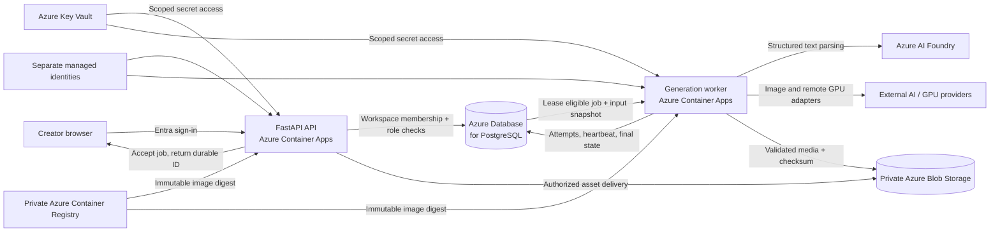

# Illustory.ai — architecture showcase

Illustory turns a script into an editable production workflow: storyboard, cast and scene references, shot assets, generated motion, enhanced video, and a final export. This repository is a **sanitized technical showcase and fictional interactive walkthrough** of the current `v1_4_0` workspace. It is not the application source, an API client, or a customer production deployment.

**Live demo:** A private preview is available to the project owner through Sites. The `dist/` directory can also be served as a static website.

## System at a glance



### What each layer owns

| Layer | Public technical detail | Ownership |
|---|---|---|
| Browser | Storyboard, cast, shots, generation activity, edit and export views | User interaction; no provider credentials |
| API and policy | FastAPI, Entra token validation, workspace membership, role checks, revision checks | Synchronous requests and authorization |
| Relational state | PostgreSQL projects, jobs, attempts, asset versions, audit events | Transactional source of truth; jobs are also the current queue |
| Worker | Separate process, lease renewal, bounded retry, cancellation and stale-result checks | Long-running provider work |
| AI and media | Azure AI Foundry for structured text parsing; external image and GPU adapters; FFmpeg for composition | Fallible generation and deterministic media assembly |
| Binary storage | Private Azure Blob Storage and local development adapter | Immutable asset bytes; database records carry references and checksums |
| Azure operations | Container Apps, Container Registry, Key Vault, managed identities, Log Analytics | Runtime, artifact, secret and telemetry boundaries |

The generation endpoint records an idempotent request and returns a job ID. A worker leases the job and records each attempt. On success, it verifies the output and publishes a new asset version only when the lease and input revision are still valid. A failed or stale attempt does not replace the current asset. See [the architecture walkthrough](docs/ARCHITECTURE.md).

## Demo boundary

The website uses hard-coded fictional content. Its buttons demonstrate state transitions in the browser; they do **not** call Illustory APIs, Azure services, model providers, or customer storage. The static site contains no private prompts, credentials, production source code, infrastructure IDs, customer data, or operational URLs. See [publication boundaries](docs/PUBLICATION_BOUNDARY.md).

## Deployment status and evidence

The source workspace documents a deployed **Azure development environment**, not a customer production launch. Its documented evidence includes authorization and worker tests, cloud smoke checks for parsing and images, immutable container revisions, and asset integrity verification. The documented open gates include a historical media provenance item, representative human quality evaluation, a customer-approved cost policy, backup/restore exercise, and alerting. The exact status may change after this showcase snapshot; this repository intentionally does not mirror private operational telemetry.

## Run locally

Serve `dist/` with any static HTTP server, for example:

```sh
python -m http.server 8000 --directory dist
```

Open `http://localhost:8000`. No environment variables, account, build step, or backend are required.

## Repository scope

This repository contains only the public presentation. The production application, private prompt and generation rules, IaC, deployment scripts, data, and tests remain in the private workspace. No license is granted for those private materials.
